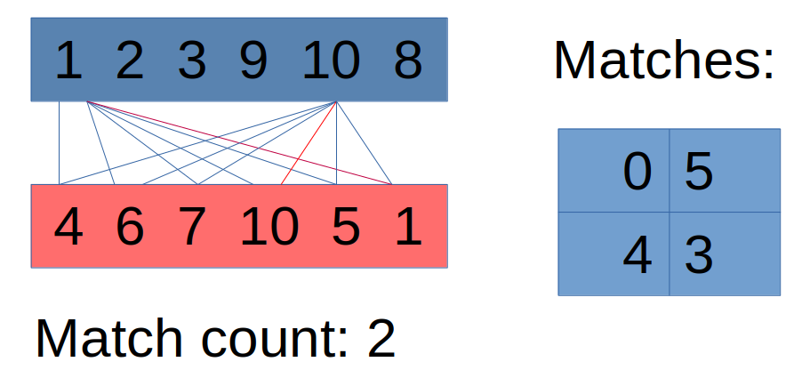
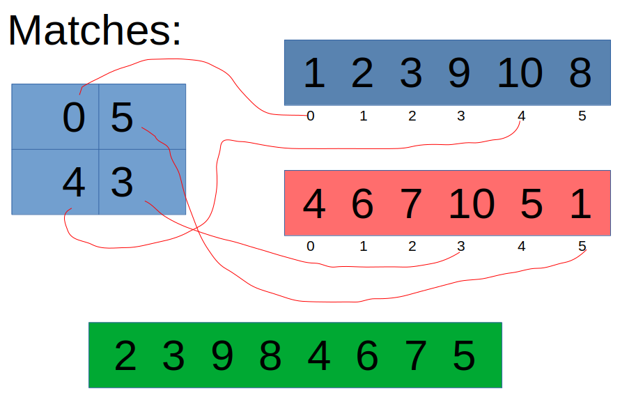

# merge-array-parallel
This application is created with the purpose the compare two implementations of the same algorithm, **serial implementation**, and **parallel implementation**.

## Summary
- [Application](#application)
- [Logic](#logic)
- [How project works ?](#howprojectworks)

## Application <a name="application"></a>

Application to merge two sets (arrays) without intersection (duplicates).
```
arr1 = {1, 2, 3, 9, 10, 8}
arr2 = {4, 6, 7, 10, 5, 1}

out = {2, 3, 9, 8, 4, 6, 7, 5}
```

## Logic <a name="logic"></a>
First, iterate each element of the array and compare it with every element of the second array. If find any match, increment one to the match counter. These nested cycles repeat two times, the first to count the matches number, and the second to save the indexes where are the duplicates.

In this matrix, the number of rows is the matches number, the first column is the indexes of the first array, and the second column is the indexes of the second array.


Then, create a new array with a new length, to calculate the new length using:
```
len = n + m - (match count * 2)
```
> n: first array length\
> m: second array length

Finally, iterate each element of the two arrays, ignoring the indexes saved in the prev matrix.


## How project works ? <a name="howprojectworks"></a>
First, create two files, these will save the results of time execution for merging two arrays with the same length.

When the two files are already saved with the results, graph them with Python trying to find the breakeven point.