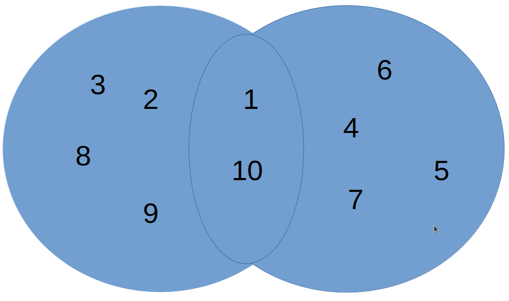

# merge-array-parallel
This application is created with the purpose the compare two implementations of the same algorithm, **serial implementation**, and **parallel implementation**.

## Summary
- [Application](#application)
- [Logic](#logic)
- [How project works ?](#howprojectworks)
- [Requirements](#requirements)
- [Compile and run](#compile-and-run)
- [Results](#results)

## Application <a name="application"></a>

Application to merge two sets (arrays) without intersection (duplicates).
```
arr1 = {1, 2, 3, 9, 10, 8}
arr2 = {4, 6, 7, 10, 5, 1}

out = {2, 3, 9, 8, 4, 6, 7, 5}
```

## Logic <a name="logic"></a>
First, iterate each element of the array and compare it with every element of the second array. If find any match, increment one to the match counter. These nested cycles repeat two times, the first to count the matches number, and the second to save the indexes where are the duplicates.

In this matrix, the number of rows is the matches number, the first column is the indexes of the first array, and the second column is the indexes of the second array.


Then, create a new array with a new length, to calculate the new length using:
```
len = n + m - (match count * 2)
```
> n: first array length\
> m: second array length

Finally, iterate each element of the two arrays, ignoring the indexes saved in the prev matrix.


## How project works ? <a name="howprojectworks"></a>
First, create two files, these will save the results of time execution for merging two arrays with the same length.

When the two files are already saved with the results, graph them with Python trying to find the breakeven point.

## Requirements <a name="requirements"></a>
- **Python >= 3.10.6**
- **matplotlib >= 3.5.2**

Compiled with:
- **GCC 11.3.0**
- **OpenMP 4.5**

## Compile and run <a name="compile-and-run"></a>
First edit the project absolute path in **merge_array.c**
```
#define PATH_SERIAL "{your path}/merge-array-parallel/data/serial_time.txt"
#define PATH_PARALLEL "{your path}/merge-array-parallel/data/parallel_time.txt"
```
#### Compile
In the project root directory.
```
$ gcc -fopenmp ./merge_array.c -o ./out/merge_array
```
#### Run
```
$ ./out/merge_array
```
#### Graph
First edit the project absolute path in **graph/main.py**
```
PATH = "{your path}/merge-array-parallel/"
```
and run:
```
$ python3 graph/main.py
```
## Results <a name="results"></a>
To try the efficiency of the two implementations, create two same arrays with 5000 elements. How the algorithm works if the two arrays have the same length, have a cuadratic cost to compare each one elements in the arrays.


So, when the two arrays with the same length to merge, is convenient parallelizing the algorithm if the number of elements are >= 280.

**[1, ~280), (~280, 5000]**

